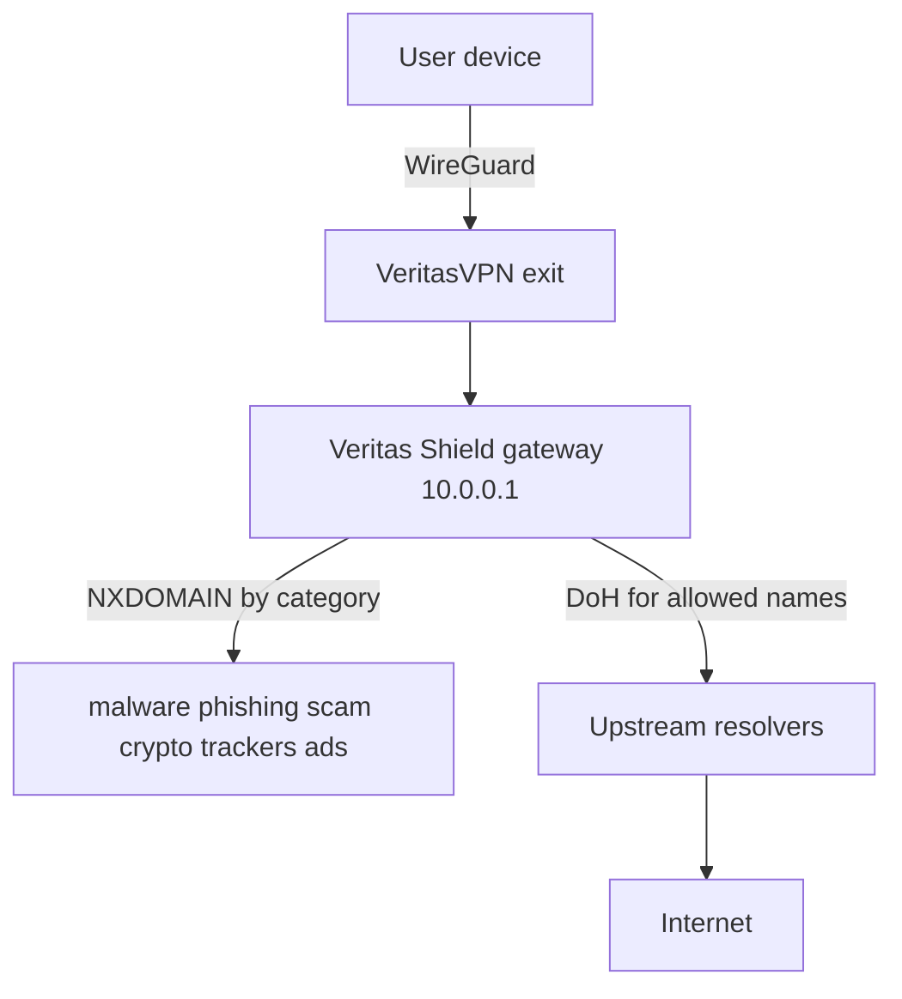

# Veritas Shield — implementation plan

**Status:** Phase 1–2 implemented (2026-09-04); Phase 3 deferred  
**Date:** 2026-09-04  
**Goal:** Productize an anti-malware / anti-tracker DNS layer branded **Veritas Shield**, layered on VeritasVPN—not a full antivirus engine.

## Product framing

```
Internet
   ↑
Veritas Shield   ← DNS security (block + filter)
   ↑
VeritasVPN       ← encrypted tunnel + exit
   ↑
User
```

Pitch becomes **VPN + DNS security + tracker blocking**, not only “we have a VPN.”

### What Shield is / is not

| Is | Is not |
|----|--------|
| In-tunnel DNS gateway policy | File/AV scanning |
| Category blocklists (malware, phishing, …) | Guaranteed block of all DoH bypasses |
| Session block counts (no query names) | Standalone public DoH (Phase 3 only) |

## Current baseline (already shipped)

Peers use `10.0.0.1` while connected. Agent (Phase 1):

- Blocks **malware**, **phishing**, **scam**, **crypto**, **trackers** by category → NXDOMAIN (ads off)
- Forwards other queries over DoH (Cloudflare / Google)
- Blocks plain DNS / DoT / well-known public DoH resolvers
- Surfaces aggregate **session blocked** counts on Android/desktop
- Exposes per-category Prometheus block counters and domain gauges

Key code: `services/veritas-agent/internal/dns/{forwarder,blocklist,doh_bypass}.go`, `deploy/k8s/base/veritas-agent.yaml`, client DNS count UI, `docs/DNS_APP_DOH_BLOCKING.md`.

## Architecture (target)



Phase 1 keeps a **single global policy** on the node (all peers). Per-user presets come in Phase 2.

## Category matrix

| Category | Phase 1 default | Candidate feeds |
|----------|-----------------|-----------------|
| Malware | On | URLhaus hostfile (existing) |
| Phishing | On | Phishing Army extended (existing) |
| Scam | On | Curated list after quality/license check; may overlap phishing initially |
| Cryptomining | On | Small nocoin-style HTTPS hosts list |
| Trackers | On | OISD **small** or StevenBlack **base** (measure size first) |
| Ads | **Off** | Same family of lists; enable via Aggressive preset later |

Ads stay off by default to limit false positives (CDNs, banks, captive portals).

## Phase 1 — Categorized blocklists in the agent

**Shipped:** categorized feeds (malware, phishing, scam, crypto, trackers; ads off), env wiring, per-category Prometheus metrics, agent memory limit 512Mi.

1. Refactor `Blocklist` into per-category sets merged by `DNS_SHIELD_CATEGORIES`.
2. Env:
   - `DNS_SHIELD_CATEGORIES=malware,phishing,scam,crypto,trackers`
   - `DNS_BLOCKLIST_URLS_<CATEGORY>=https://…` (comma-separated)
   - Legacy `DNS_BLOCKLIST_URLS` → malware+phishing fallback for rollback
3. Metrics: `veritas_agent_dns_blocked_by_category_total{category}` + `veritas_agent_dns_blocklist_domains_by_category{category}`.
4. Memory soak vs DaemonSet limit (raised to 512Mi for larger lists).
5. Roll `veritas-agent` on Dell; watch stale-blocklist alerts and FP reports.
6. **No** client API / toggle work in this phase.

## Phase 2 — Branding and UX

**Shipped:** Veritas Shield branding (apps, website `#dns`, FAQ, Learn, privacy); Learn article `what-is-veritas-shield`; presets Security / Standard / Aggressive on peers; agent policy by tunnel IP; `DNS_SHIELD_ALLOWLIST` escape hatch.

1. Rename Protected DNS → **Veritas Shield** (Android, desktop, website `#dns`, FAQ, Learn, privacy).
2. Homepage: “VPN + Veritas Shield” messaging; Learn article `what-is-veritas-shield`.
3. Keep honesty: upstream DoH sees non-blocked hostnames; residual custom DoH bypass.
4. Optional presets: **Security** / **Standard** (+trackers) / **Aggressive** (+ads).
5. Control plane: store preset on peer; agent selects policy by tunnel IP.
6. Minimum allowlist escape for Aggressive mode FPs (`DNS_SHIELD_ALLOWLIST`).

## Phase 3 — Explicitly deferred

- Standalone DoH/DoT for home routers without VPN
- Chrome extension DNS (remains proxy-only)
- Full antivirus / on-device scanning

## Privacy constraints (non-negotiable)

- No query names in Prometheus or durable logs
- Tunnel-IP session counters only (existing model)
- Privacy policy + Learn updated when categories expand

## Success criteria

| Phase | Done when |
|-------|-----------|
| 1 | Live gateway blocks malware+phish+scam+crypto+trackers; ads off; category metrics; agent healthy |
| 2 | Product surfaces say Veritas Shield; optional presets |
| 3 | Tracked as a future epic only |

## Suggested build order (when approved)

1. Agent categorized blocklist + env + metrics + memory test  
2. Production feed URLs (ads off) + Dell rollout  
3. Branding/copy + Learn  
4. Follow-up: presets + allowlist  

## Out of scope for first ship

- Hundreds of marketing pages specific to Shield (Learn already covers DNS concepts)
- Changing WireGuard/auth/billing core flows
- Claiming “blocks all ads forever” or “replaces antivirus”
